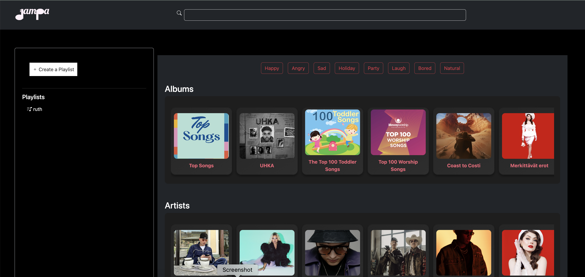

# <h1 align='center'>JAMPA</h1>

A playlist generator using the Spotify API, designed to match human moods and enhance music experiences. Perfect for enjoying a party without worrying about choosing the right songs.
This is geared towards everyone and to all all age groups.



## Built with:
- HTML
- JS
- CSS
- Reactjs
- Bootstrap


## Getting Started /Usage
- First install npm to get node_modules if you do not have.  
```
npm install
```

- Start the project. Take the link given in the terminal into the browser.
```b
npm run dev
```

## Sources
Spotify API

## Authors and acknowledgment

1. [Nikita Luzianin](https://github.com/nikiluzianin)
2. [Ruth Asafu-Adjaye](https://github.com/RuthieRuth)
3. [Puja Kumari](https://github.com/Pujakumari1511)
4. [Sayeed Anwar](https://github.com/iamharryda)
5. [Saimun Islam](https://github.com/plabon013)

And to all our mates who helped us through the building of this project.
